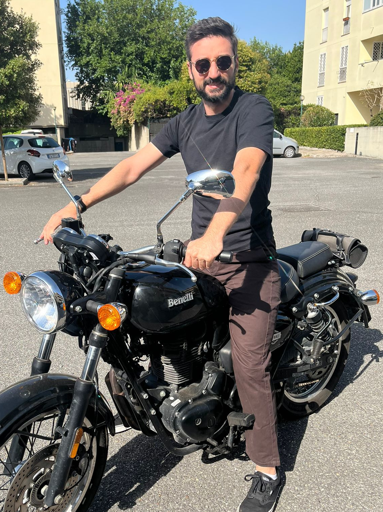

## Who I am ?
Welcome, visitor!
Let me introduce myself: as you can read in bold at the top-left of this page, my name is Alessandro Straziota, and I am a PhD student in Data Science at the [University of Rome Tor Vergata](https://web.uniroma2.it/), under the spervision of Prof. [Luciano Gualà](https://www.mat.uniroma2.it/~guala/), and co-supervised by Prof. [Andrea Clementi](https://scholar.google.com/citations?user=yoiAbLMAAAAJ&hl=it).
My main research interests (and my actual research work as PhD) lie in **Theoretical Computer Science**, particularly in **Data Structures** and **Randomized Algorithms for Dynamic/Streaming Data**.

<em>A photo of myself on my motorcycle.</em>

<!-- What? You've never heard of data sketches?
Well, sooner or later, I will write an article about them on this site, but for now, just know that they are compact and highly efficient **probabilistic** data structures. -->

As I just mentioned, I'm passionate about theoretical computer science. But that's not all...
I'm interested in computer science in general, in every aspect of it -- both theoretical and practical.
So, besides studying complex theorems and proofs, I have a lot of fun programming and tinkering with computers.
Most of all, I love implementing data structures in `C++`, learning new programming languages and paradigms.

Maybe all this sounds a bit boring to you. Maybe you are right.
But I assure you, I do have "normal" hobbies too!
For example, I enjoy painting miniatures (see [[images/minis/karazai_1.jpg|this]] or [[images/minis/knight-vexillor_1.jpg|this]]), and I love riding my motorcycle (see right 👉).

That's pretty much all I have to say, mostly because, unfortunately, my days only have 24 hours.
And after sleeping and taking care of other basic needs, there's not much time left for additional hobbies.

Oh, almost forgot! My favorite color is green, my favorite pizza is Margherita with [mozzarella di bufala](https://en.wikipedia.org/wiki/Buffalo_mozzarella) 🍕, and I love beer 🍺.[^1]

## Links
[DBLP](https://dblp.org/pid/382/6138.html) -- [Scholar](https://scholar.google.com/citations?user=yNAvwNEAAAAJ&hl=it) -- [Github](https://github.com/Alessandrostr95)

## Education
- **Bachelor's Degree in Computer Science**, University of Rome Tor Vergata, 2021 -- summa cum laude
- **Master's Degree in Computer Science**, University of Rome Tor Vergata, 2023 -- summa cum laude (average grade: 30/30)
- **PhD in Data Science**, University of Rome Tor Vergata, 2023 - present

## Publications
#### 2026
- "**Detecting Large Quasi-cliques on Dynamic Networks**" -- *under review* -- Luciano Gualà, Simone Pellegrini, Luca Pepè Sciarria, Alessandro Straziota. ([full version](https://arxiv.org/abs/2606.05809))
- "**A Tour of Locality Sensitive Filtering on the Sphere**" -- *under review* -- Luca Becchetti, Andrea Clementi, Luciano Gualà, Emanuele Natale, Luca Pepè Sciarria, Alessandro Straziota. ([full version](https://arxiv.org/abs/2604.24323))
- "**Hierarchical Spanners**" -- *under review* -- Davide Bilò, Luciano Gualà, Stefano Leucci, Guido Proietti, Alessandro Straziota.
#### 2025
- "**Almost Tight Oracles for Fastest-Path Queries on Temporal Trees**" -- *ALGOWIN 2025* -- Davide Bilò, Luciano Gualà, Stefano Leucci, Guido Proietti, Alessandro Straziota.
- "**Approximate $2$-hop neighborhoods on incremental graphs: An efficient lazy approach**" -- *VLDB 2025* -- Luca Becchetti, Andrea Clementi, Luciano Gualà, Luca Pepè Sciarria, Alessandro Straziota, Matteo Stromieri. ([full version](https://arxiv.org/abs/2502.19205) -- [[vldb25/presentation/approximate_two_hop.pdf|presentation]] -- [[vldb25/poster/posterA0.pdf|poster]])
- "**Maintaining $k$-MinHash Signatures over Fully-Dynamic Data Streams with Recovery.**" -- *WSDM 2025* -- Andrea Clementi, Luciano Gualà, Luca Pepè Sciarria, Alessandro Straziota. ([full version](https://arxiv.org/abs/2407.21614) -- [WSDM'25 proceedings](https://dl.acm.org/doi/10.1145/3701551.3703491) -- [[wsdm25/presentation/slides.pdf|presentation]] -- [[wsdm25/poster/posterA0.pdf|poster]] -- [code](https://github.com/Alessandrostr95/DynamicMinHash))
#### 2024
- "**Temporal Queries for Dynamic Temporal Forests.**" -- *ISAAC 2024* -- Davide Bilò, Luciano Gualà, Stefano Leucci, Guido Proietti, Alessandro Straziota. ([full version](https://arxiv.org/abs/2409.18750) -- [ISAAC'24 proceedings](https://drops.dagstuhl.de/entities/document/10.4230/LIPIcs.ISAAC.2024.11) -- [[isaac24/presentation/slides.pdf|presentation]])
- "**Graph Spanners for Group Steiner Distances.**" -- *ESA 2024* -- Davide Bilò, Luciano Gualà, Stefano Leucci, Alessandro Straziota. ([full version](https://arxiv.org/abs/2407.01431) -- [ESA'24 proceedings](https://drops.dagstuhl.de/entities/document/10.4230/LIPIcs.ESA.2024.25) -- [[esa24/presentation/group_steiner_spanners.pdf|presentation]])

## Grants
#### 2025
- \$1,000.00 for The Eighteenth ACM International Conference on Web Search and Data Mining.

## Workshops
#### 2025
- Poster session at **[CACN -- Computational Aspects of Complex Networks and Artificial Intelligence](https://www.mat.uniroma2.it/bertaccini/CACN25/)**.

#### 2024
- Poster session at **[CACN -- Computational Aspects of Complex Networks](https://www.mat.uniroma2.it/progetto/Events_pages/2024/Cacn2024/page-cacn2024.php)**.

## Teaching
- **2021 - present**: Tutor for Data Structures and Algorithms course at University of Rome Tor Vergata.
- **Winter 2024**: four lectures on Advanced Data Structures course at University of Rome Tor Vergata.

## Contact
You can reach me at my email [alessandro.straziota@uniroma2.it](mailto:alessandro.straziota@uniroma2.it), or at my personal email address [alessandrostr95@gmail.com](mailto:alessandrostr95@gmail.com).

------

> [!WARNING]
> This page is a work in progress, so it contains only few information about me, and it is not yet complete.
> I will update it as soon as possible.

[^1]: stout and lager are my favorite types of beer.